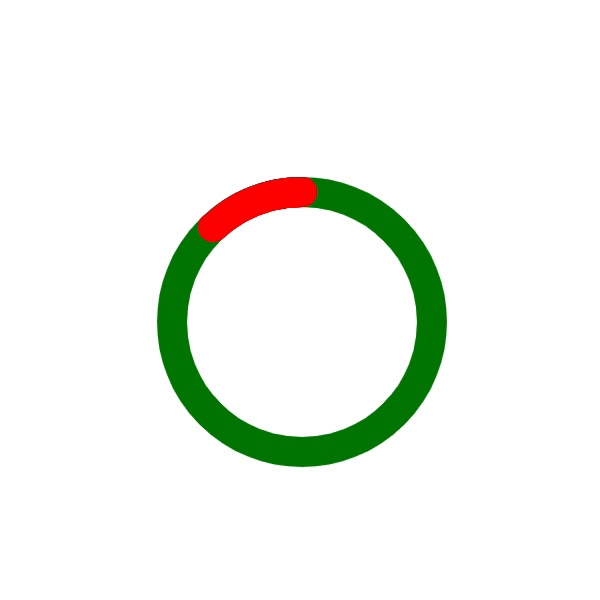

在工作中经常有绘制圆环进度条的需求,如下效果，如何能够快速简单地实现呢？



首先我们需要了解canvas制图的一些基本要素，如弧度、坐标系等。


坐标系和弧度对应关系如下：


开始绘制
```
var circleObj =  {
    /* 圆心 */
    x: 160,
    y: 160,
    /* 半径 */
    radius: 130,
    /* 环的宽度 */
    lineWidth: 30,
}
var canvas1 = document.querySelector('#canvas1')
var canvas2 = document.querySelector('#canvas2')
var fullCircleAngle = Math.PI * 2 
function drawCircle(canvas, startAngle, endAngle, color) {
    const circleObj = this.circleObj
    const ctx = canvas.getContext('2d')
    ctx.beginPath()
    ctx.arc(circleObj.x, circleObj.y, circleObj.radius, startAngle, endAngle, false)
    // 设定曲线粗细度
    ctx.lineWidth = circleObj.lineWidth
    // 给曲线着色
    ctx.strokeStyle = color
    // 连接处样式
    ctx.lineCap = 'round' //以圆形结束，还可以选择方形butt
    // 给环着色
    ctx.stroke()
    ctx.closePath()
}
```

先绘制一个完整的圆环
```
drawCircle(canvas1,0,fullCircleAngle,'green')
```
再绘制一个跟随时间弧度变化的不完整圆环
```
var percent = 0
var timer = setInterval(function(){
    var startAngle = Math.PI * 2 * 0.75 - (percent) * Math.PI * 2 / 100
    var endAngle = fullCircleAngle * 0.75
    this.drawCircle(canvas2, startAngle, endAngle, 'red')
    percent  = percent +2
    if(percent > 100){
        clearInterval(timer)
    }
},500)
```
最后附上[示例代码](https://github.com/liqiuhui/blog/blob/master/percent/index.html)